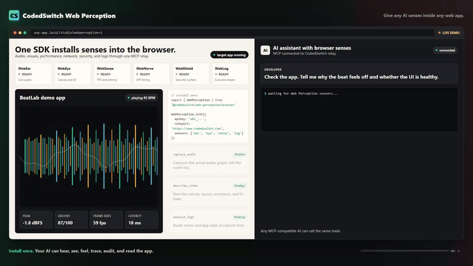

# webear

[](https://www.npmjs.com/package/webear)
[](https://www.npmjs.com/package/webear)
[](./LICENSE)
[](https://modelcontextprotocol.io)

**Give your AI real senses — hear, see, and feel any web app.**

An [MCP](https://modelcontextprotocol.io) server + browser SDK that gives AI coding assistants **direct sensory access** to a live web application. Audio, visuals, performance, network, security, and console — captured from the browser, analyzed in real time, delivered via MCP.

> *"The beat sounds muddy"* → your AI captures 3 seconds, measures the spectral centroid at 580 Hz with 45% energy below 250 Hz, and tells you exactly why.

---



---

## What It Does

| Tool | Description |
|------|-------------|
| `capture_audio` | Record a short clip (500ms–30s) of what your web app is outputting right now |
| `analyze_audio` | Signal analysis: RMS, peak dB, clipping, spectral centroid, frequency bands, BPM, timing jitter |
| `describe_audio` | Plain-English AI description — *"the kick is boomy with heavy sub buildup around 80 Hz"* |
| `diff_audio` | Compare two captures and flag what changed — loudness, tone, timing, clipping |

## How It Works

```
Browser (Web Audio API)
    ↓ MediaRecorder taps the AudioContext output node
    ↓ Uploads WebM blob via HTTP POST
Express Middleware (your dev server)
    ↓ Stores captures in memory, dispatches commands via SSE
MCP Server (stdio — runs inside your IDE)
    ↓ Retrieves captures, sends to CodedSwitch analysis API
AI Coding Assistant
    → "Your bass band is 42% of the mix (high), spectral centroid
       is 580 Hz (muddy), and timing jitter is 23ms — the scheduler
       is drifting under load."
```

The key difference from every other audio MCP: **this taps the Web Audio graph directly**, bypassing room acoustics, microphone hardware, and the need to export files.

---

## Quick Start

### 1. Install

```bash
npm install webear
```

### 2. Add the Express middleware to your dev server

```js
import express from 'express'
import { webearMiddleware } from 'webear/middleware'

const app = express()
app.use(express.json())

// Mount the audio debug bridge (automatically disabled in production)
app.use('/api/webear', webearMiddleware())

app.listen(5000)
```

### 3. Add the client snippet to your web app

**Option A — auto-detect everything (Tone.js or raw Web Audio)**
```js
import WebEar from 'webear/client'
WebEar.init()
```

**Option B — explicit AudioContext**
```js
const ctx = new AudioContext()
const masterGain = ctx.createGain()
masterGain.connect(ctx.destination)

WebEar.init({ audioContext: ctx, outputNode: masterGain })
```

**Option C — Tone.js project**
```js
import * as Tone from 'tone'
WebEar.init({ toneJs: true })
```

**Option D — Three.js WebGL Game**
```js
import * as THREE from 'three'
const listener = new THREE.AudioListener()
camera.add(listener)
WebEar.init({ tapNode: listener.getInput() })
```

**Option E — plain script tag**
```html
<script src="node_modules/webear/client-snippet.js"></script>
<script>WebEar.init()</script>
```

### 4. Configure your IDE

**Claude Code** (`.mcp.json` in project root):
```json
{
  "mcpServers": {
    "webear": {
      "command": "npx",
      "args": ["webear"],
      "env": {
        "WEBEAR_BASE_URL": "http://localhost:5000",
        "CODEDSWITCH_API_KEY": "your-key-here"
      }
    }
  }
}
```

**Cursor** (`.cursor/mcp.json`):
```json
{
  "mcpServers": {
    "webear": {
      "command": "npx",
      "args": ["webear"],
      "env": {
        "WEBEAR_BASE_URL": "http://localhost:5000",
        "CODEDSWITCH_API_KEY": "your-key-here"
      }
    }
  }
}
```

**Windsurf** (`mcp_config.json`):
```json
{
  "webear": {
    "command": "npx",
    "args": ["webear"],
    "disabled": false,
    "env": {
      "WEBEAR_BASE_URL": "http://localhost:5000",
      "CODEDSWITCH_API_KEY": "your-key-here"
    }
  }
}
```

### 5. Get an API key

1. Create a free account at **[codedswitch.com](https://www.codedswitch.com)**.
2. Go to **[codedswitch.com/developer](https://www.codedswitch.com/developer)** (also in the account menu as **Developer API**).
3. Click **Generate API Key** — that value is your `CODEDSWITCH_API_KEY`. Keys start with `wbr_`.

Free tier: 50 analyses/day. No credit card required.

### 6. Start your dev server, open your app, play audio, then ask your AI:

> "Capture 3 seconds and tell me why the bass sounds muddy."

> "Compare the audio before and after my last commit."

> "Is there any clipping in the high-frequency range?"

---

## Example Output

### `analyze_audio`

```
── Audio Analysis Report ──────────────────────────────
Duration:          3.02s

── Loudness ─────────────────────────────────────────
RMS:               -12.4 dBFS
Peak:              -1.2 dBFS
Dynamic range:     11.2 dB
Crest factor:      3.63
Clipping:          none

── Tone ──────────────────────────────────────────────
Spectral centroid: 2847 Hz
DC offset:         0.00012 (ok)

── Frequency Bands ───────────────────────────────────
Sub  (20-80 Hz):   8.2%
Bass (80-250 Hz):  22.1%
Mid  (250-2k Hz):  38.4%
Hi-mid (2-6k Hz):  21.8%
High (6k+ Hz):     9.5%

── Rhythm ────────────────────────────────────────────
Estimated BPM:     92
Onset count:       12
Timing jitter:     4.2 ms std dev

── Summary ───────────────────────────────────────────
Loudness: -12.4 dBFS RMS, peak -1.2 dBFS. Tone: balanced (centroid 2847 Hz).
Band mix — sub: 8% | bass: 22% | mid: 38% | hi-mid: 22% | high: 10%.
Rhythm: estimated 92 BPM, 12 onsets detected. Timing: very tight (< 5 ms jitter).
```

### `diff_audio`

```
── Audio Diff: a1b2c3d4… → e5f6g7h8… ──

── Loudness ──────────────────────────────────────────
  RMS: -14.2 dBFS → -12.4 dBFS  (+1.8 dBFS)
⚠ Peak: -3.1 dBFS → -0.2 dBFS  (+2.9 dBFS)
⚠ CLIPPING INTRODUCED — gain staging regression

── Tone ──────────────────────────────────────────────
⚠ Spectral centroid: 2847.0 Hz → 1920.0 Hz  (-927.0 Hz)

── Interpretation ────────────────────────────────────
A gain bug was introduced that causes clipping.
Tonal character changed noticeably — EQ or filter behaviour may have shifted.
```

---

## Configuration

### Environment Variables

| Variable | Default | Description |
|----------|---------|-------------|
| `WEBEAR_BASE_URL` | `http://localhost:4000` | URL of your dev server (where middleware is mounted) |
| `CODEDSWITCH_API_KEY` | — | API key from [codedswitch.com](https://www.codedswitch.com) — required for `analyze_audio` and `describe_audio` |
| `MCP_API_URL` | `https://www.codedswitch.com` | Override the analysis API base (advanced / self-hosted) |

### Middleware Options

```js
webearMiddleware({
  maxCaptures: 50,       // Max captures in memory (default: 50)
  maxAgeMins: 10,        // Auto-evict after N minutes (default: 10)
  maxUploadBytes: 50e6,  // Max upload size (default: 50MB)
  devOnly: true,         // Disable in production (default: true)
})
```

### Client Options

```js
WebEar.init({
  audioContext: myCtx,             // Your AudioContext instance
  outputNode: myGainNode,          // The node to tap (defaults to destination)
  toneJs: true,                    // Auto-detect Tone.js context
  bridgeBase: '/api/webear',  // Override API path
  devOnly: true,                   // Only init outside of production (default: true)
})
```

---

## Requirements

- **Node.js** >= 18
- A browser that supports `MediaRecorder` (Chrome, Firefox, Edge, Safari 14+)
- A `CODEDSWITCH_API_KEY` for analysis (free at [codedswitch.com](https://www.codedswitch.com))

---

## Who Is This For?

- **Web Audio / Tone.js developers** — debug beats, synths, effects, and mixing without leaving your IDE
- **Game audio developers** — verify sound effects, spatial audio, and mixing in real-time
- **Music app builders** — catch regressions between code changes with `diff_audio`
- **Podcast / streaming apps** — validate audio quality, levels, and encoding
- **Anyone whose app makes sound** — if it has a Web Audio graph, your AI can now hear it

---

## Why Not Just Use the Microphone?

Microphone MCPs capture room sound — your fan noise, chair creaks, and room reverb are all in the recording. `webear` taps the Web Audio API **before it hits the DAC**, giving you a clean digital signal with no room artifacts.

---

## Web Perception — Full Sensor Suite

WebEar started as audio-only. **Web Perception** expands it to 6 senses:

| Sensor | What it perceives |
|---|---|
| **WebEar** | Audio — mix quality, rhythm, instruments, clipping |
| **WebEye** | Visual — canvas, UI layout, animations, screenshots |
| **WebSense** | Performance — frame rate, memory, audio latency |
| **WebNerve** | Network — API latencies, connection quality, storage |
| **WebShield** | Security — cookies, storage exposure, CSP, framing |
| **WebLog** | Console — logs, warnings, errors, uncaught exceptions |

### Install the full browser SDK

```js
import { WebPerception } from 'webear/perception'

WebPerception.init({
  apiKey: 'wbr_YOUR_API_KEY',
  relayUrl: 'https://www.codedswitch.com',
  sensors: ['ear', 'eye', 'sense', 'nerve', 'shield', 'log'],
})
```

Or use a single sensor:

```js
import { WebEar } from 'webear/perception'

WebEar.init({
  apiKey: 'wbr_YOUR_API_KEY',
  ear: { audioContext: myCtx, audioNode: masterGain },
})
```

### Connect via MCP (hosted relay — no local server required)

```json
{
  "mcpServers": {
    "webear": {
      "url": "https://www.codedswitch.com/api/webear/mcp/sse",
      "headers": {
        "Authorization": "Bearer wbr_YOUR_API_KEY"
      }
    }
  }
}
```

### Available MCP Tools

| Sensor | Tool | Credits | Description |
|---|---|---|---|
| **Ear** | `capture_audio` | Free | Record live tab audio |
| **Ear** | `analyze_audio` | 1 | BPM, loudness, frequency bands, clipping, dynamic range |
| **Ear** | `describe_audio` | 2 | AI plain-English description — instruments, genre, mood, mix notes |
| **Ear** | `diff_audio` | 1 | Compare two captures — loudness, tone, timing deltas |
| **Ear** | `groove_score` | 2 | Grid alignment, swing factor, consistency (0–100%) |
| **Ear** | `capture_and_analyze` | 1 | Capture + analysis in one call |
| **Ear** | `mix_coach` | 3 | Structured mixing feedback |
| **Eye** | `capture_video` | Free | Record canvas/video from the tab |
| **Eye** | `describe_video` | 2 | AI visual description — layout, colors, bugs |
| **Eye** | `diff_visuals` | 2 | Compare two visual captures |
| **Sense** | `capture_telemetry` | Free | FPS, memory, layout shifts, audio latency |
| **Sense** | `analyze_telemetry` | 1 | Frame drops, memory pressure, audio underruns |
| **Nerve** | `capture_nerve` | Free | API timings, connection quality, storage size |
| **Nerve** | `analyze_nerve` | 1 | Slow APIs, connection quality, storage bloat |
| **Shield** | `capture_shield` | Free | Cookies, CSP, storage exposure, framing |
| **Shield** | `analyze_shield` | 1 | CORS issues, non-HttpOnly cookies, missing CSP |
| **Log** | `capture_logs` | Free | Console output + uncaught exceptions |
| **Log** | `analyze_logs` | 1 | Error patterns, stack traces, repeated warnings |

### Get an API Key

1. Create a free account at **[codedswitch.com](https://www.codedswitch.com)**.
2. Open **[codedswitch.com/developer](https://www.codedswitch.com/developer)** — also linked as **Developer API** in the account menu.
3. Click **Generate API Key** and copy it. Keys start with `wbr_`.

Free tier: 50 analyses/day, no credit card required.

---

## Changelog

### 2.0.1
- **Fixed the getting-started path for API keys.** The previous instruction
  ("Settings → WebEar") was wrong — there is no WebEar section under Settings.
  Keys live at **[codedswitch.com/developer](https://www.codedswitch.com/developer)**
  (linked as **Developer API** in the account menu). Both the Quick Start and the
  Web Perception sections now point to the correct place.
- The SDK's "missing API key" console error now links straight to the key page.

## Contributing

See [CONTRIBUTING.md](./CONTRIBUTING.md).

## License

MIT — see [LICENSE](./LICENSE)

## Author

Built by [@asume21](https://github.com/asume21) — [CodedSwitch](https://www.codedswitch.com)
